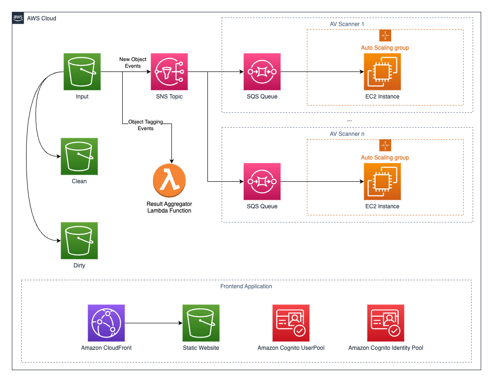

# Virus Scanner for S3 Bucket - Readme

## Overview

This solution provides a comprehensive and scalable virus scanning mechanism for files incoming into an Amazon S3 bucket. It uses multiple antivirus scanners running on Windows, allowing users to choose their preferred solutions. The architecture includes AWS Simple Notification Service (SNS), Amazon Simple Queue Service (SQS), Amazon EC2 instances, managed by an Auto Scaling Group, and an aggregator Lambda function. The repository contains examples to set up the [ClamAV open source antivirus engine](https://www.clamav.net/) and Windows Defender. Read the "Config" section to learn how to configure your own AV scanner. 
The solution also comes with a minimal frontend, hosted on Amazon S3 + Amazon CloudFront and using Amazon Cognito for authentication and authorization.

## Architecture Overview



### S3 Buckets

The solution deploys 3 Amazon S3 Buckets.

- **Input Bucket**: This is where incoming files are initially placed for scanning. Files remain in this bucket during the scanning process.

- **Clean Files Bucket**: Files that pass the virus scan are moved to this bucket. These files are considered safe and can be used without any security concerns.

- **Dirty Files Bucket**: Files that are flagged during the virus scan are moved to this bucket. These files are considered potentially unsafe and should be reviewed or further analyzed.

- **Static Website Bucket**: Contains the Single Page Application Frontend

### Tags

Each antivirus scanner adds two tags to the files in the input bucket based on the scan results: One that dertermines if the scan was completed and one with the actual scan result.

### Aggregator Lambda Function

An aggregator Lambda function evaluates the tags added by the antivirus scanners. It determines whether a file should be moved to the clean files bucket or the dirty files bucket based on the aggregated scan results. This Lambda function provides a centralized decision point for managing files based on the outputs of multiple scanners.

## Prerequisites

Before deploying the solution, make sure you have the following:

- [AWS CLI](https://aws.amazon.com/cli/) installed and configured with the necessary permissions.
- [AWS CDK](https://aws.amazon.com/cdk/) installed on your local machine.

You may use [AWS Cloud9](https://aws.amazon.com/cloud9/), a cloud-based integrated development environment (IDE) that fullfils all theser prerequisites, to deploy the solution.

## Deployment

1. Clone the repository:

    ```bash
    git clone <repository url>
    cd repository
    ```

2. Deploy the solution using AWS CDK:

    ```bash
    cdk deploy
    ```

    Follow the prompts to deploy the solution. The CDK will create the necessary AWS resources.

3. Monitor the deployment progress and check the AWS CloudFormation console for details.

## Configuration

To configure your own antivirus scanners, you need to create two powershell scripts:

* `install.ps1` - Installs the scanner on instance start up
* `scan.ps1` - Invoked to scan the files. Use the file path as parameter and returns either `CLEAN`, `INFECTED` or `ERROR`

Examples for the [ClamAV open source antivirus engine](https://www.clamav.net/) and Windows Defender can be found under `./examples/`

In `./lib/s3-bucketscan-stack.ts`, create one construct per scanner:

```typescript
    const firstScanner = new ec2Scanner(this, "FirstScanner", {
      vpc,
      inputTopic,
      inputBucket,
      tagPrefix: "FIRST_SCANNER",
      avPath: "./examples/clamav/",
      // instanceType: OPTIONAL - configure the EC2 Instance Type here. Default: m6a.large,
      // machineImage: OPTIONAL - configure the AMI. Default: WINDOWS_SERVER_2019_ENGLISH_FULL_BASE
    });
```

Change the variable name, construct name and `tagPrefix` to meaningful names for your AV scanner. Set `avPath` to the path where you AV scanner scripts are located.

Then, add the `tagPrefix` to the aggregator lambda function's `PREFIXES` environment variable:
```typescript
    // Lambda function to aggregate the results and copy the files to clean/dirty buckets
    const aggregateFunction = new lambda.Function(this, 'AggregateFunction', {
      runtime: lambda.Runtime.NODEJS_18_X,
      handler: 'index.handler',
      code: lambda.Code.fromAsset("./resources/aggregator"),
      environment: {
        "CLEAN_BUCKET": cleanBucket.bucketName,
        "DIRTY_BUCKET": dirtyBucket.bucketName,
        "PREFIXES": "FIRST_SCANNER,SECOND_SCANNER" // Add your prefixes here
      }
    });
```

## Limitations

The following characters are not allowed in file names: `; / \ ? : @ & = + $ , # < > | “ *`

## Testing

After deployment, upload a file to the input S3 bucket. The EC2 instances in the Auto Scaling Groups will process incoming files, add tags based on the scan results, and the aggregator Lambda function will decide to move the files to the clean or dirty S3 bucket.

## Cleanup

To remove all AWS resources created by this solution, run:

```bash
cdk destroy
```

Follow the prompts to confirm resource deletion.

## Conclusion

This solution offers a robust virus scanning system for S3 buckets, utilizing dedicated buckets for input, clean files, and dirty files. Multiple antivirus scanners contribute to the scanning process, and an aggregator Lambda function ensures efficient file management based on aggregated scan results. For ongoing maintenance and updates, refer to the AWS CDK documentation and the respective antivirus software documentation.
